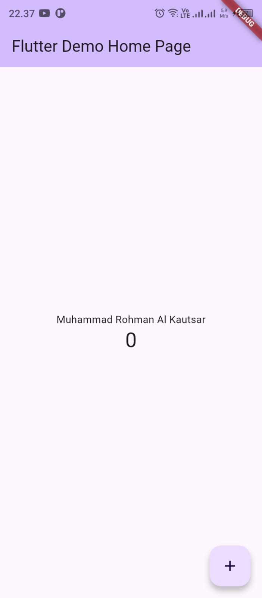
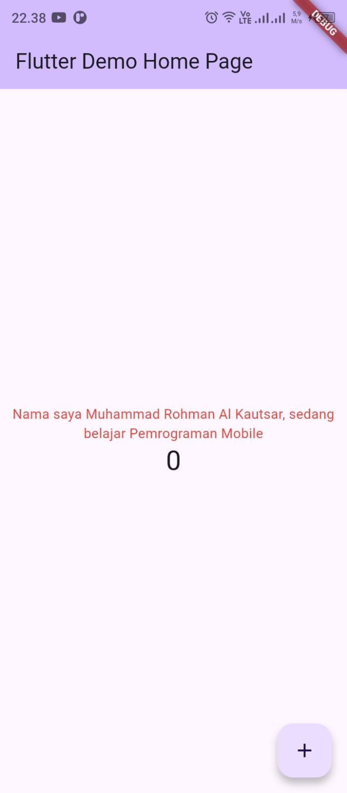
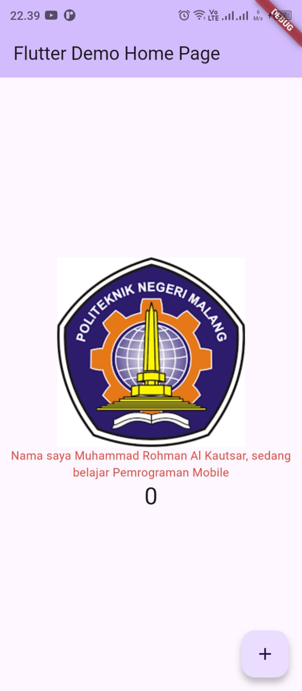
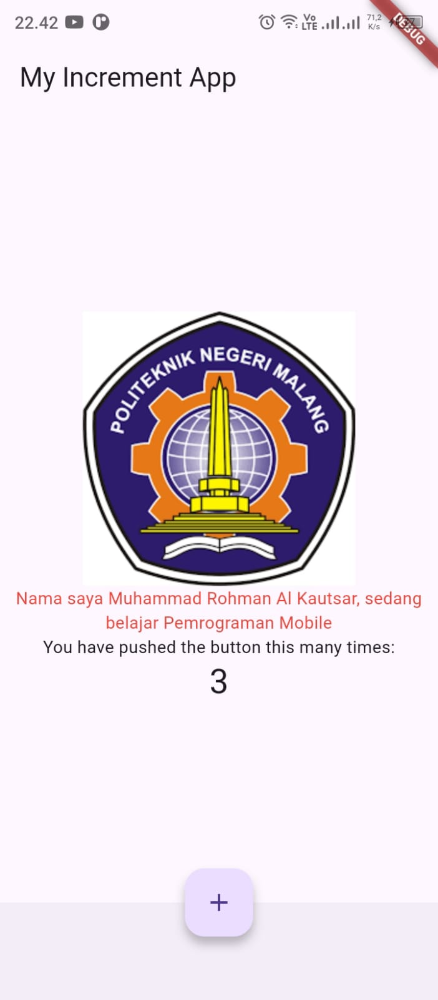
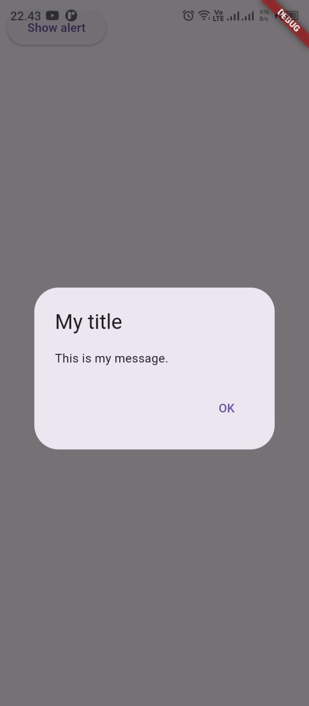
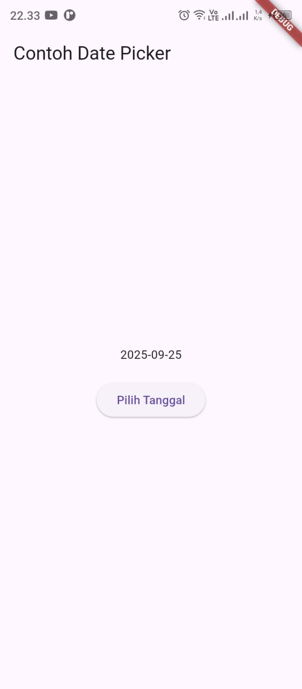
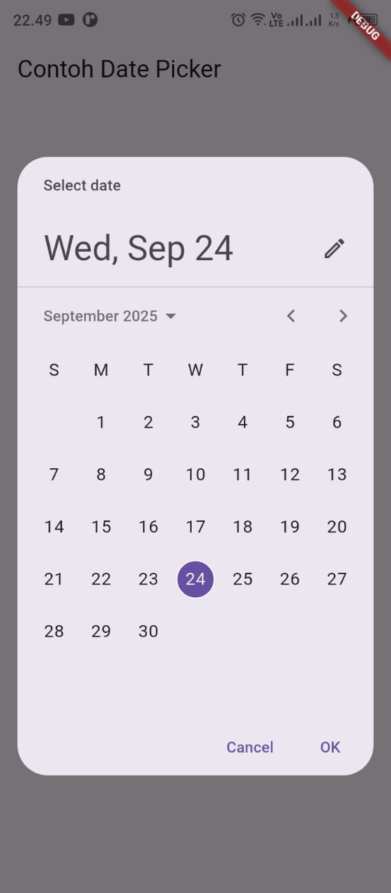

#### Nama: Muhammad Rohman Al Kautsar  
#### NIM : 2341760055  

# 🚀 Hello World Flutter App  

Proyek ini merupakan aplikasi Flutter sederhana untuk mempelajari dasar-dasar Flutter  

---

## 📸 Screenshot Perkembangan  

### 1️⃣ Mengganti Teks Biasa  
Pada tahap awal, aplikasi hanya menampilkan teks bawaan yang kemudian diganti menjadi nama saya.  

  

---

### 2️⃣ Menggunakan `text_widget.dart`  
Selanjutnya, teks ditampilkan menggunakan **Text Widget** yang dipisahkan ke dalam file baru (`text_widget.dart`) agar kode lebih rapi dan reusable.  

  

---

### 3️⃣ Menambahkan Logo Polinema dengan `image_widget.dart`  
Pada tahap ini, aplikasi ditambahkan gambar **logo Polinema** menggunakan **Image Widget** yang dibuat dalam file `image_widget.dart`.  

  

---

### 4️⃣ Menambahkan Scaffold Widget  
Pada tahap ini, aplikasi ditambahkan **Scaffold Widget** yang digunakan untuk mengatur tata letak sesuai dengan Material Design.  

  

---

### 5️⃣ Menambahkan Dialog Widget  
Pada tahap ini, aplikasi ditambahkan **Dialog Widget**.  
Flutter menyediakan dua jenis dialog utama:  

- **Screenshot 005.1 → Button Alert**  
- **Screenshot 005.2 → Alert Dialog**  

  
  

---

### 6️⃣ Menambahkan Input dan Selection Widget  
Pada tahap ini, aplikasi ditambahkan widget yang dapat menerima input dari pengguna aplikasi yaitu **TextField**.  

  

---

### 7️⃣ Menambahkan Date and Time Pickers  
Pada tahap ini, aplikasi ditambahkan **Date and Time Pickers** yang termasuk pada kategori input dan selection widget.  

- **Screenshot 007.1 → Initial Display**  
- **Screenshot 007.2 → Date Picker**  

  
  

