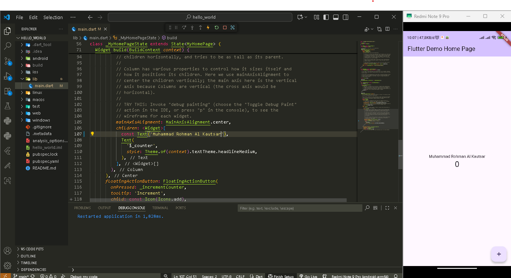
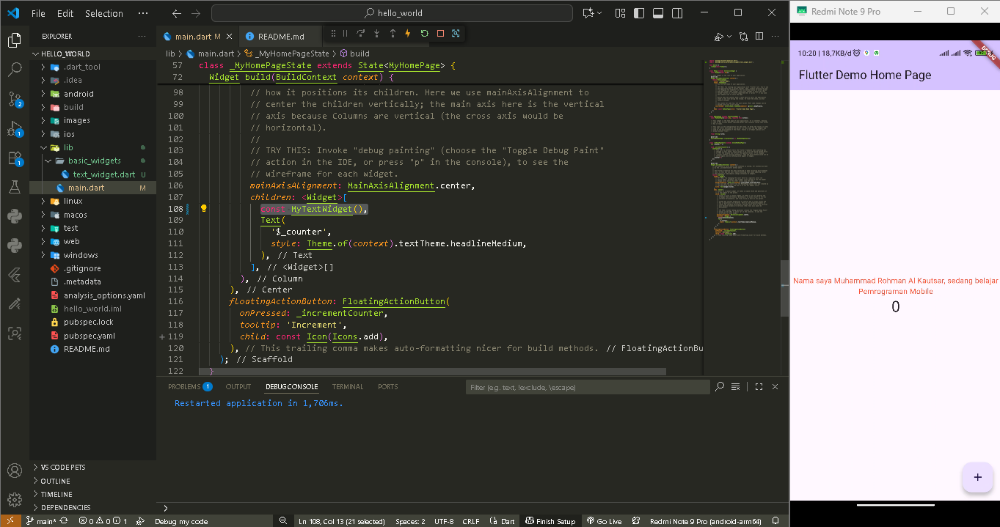
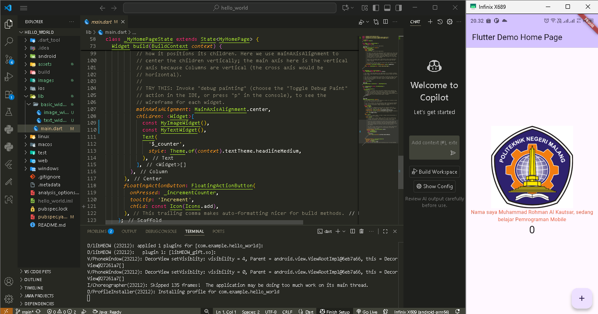

# 🚀 Hello World Flutter App

Proyek ini merupakan aplikasi Flutter sederhana untuk mempelajari dasar-dasar Flutter

---

## 📸 Screenshot Perkembangan

### 1️⃣ Mengganti Teks Biasa  
Pada tahap awal, aplikasi hanya menampilkan teks bawaan yang kemudian diganti menjadi nama saya.  

---

### 2️⃣ Menggunakan `text_widget.dart`  
Selanjutnya, teks ditampilkan menggunakan **Text Widget** yang dipisahkan ke dalam file baru (`text_widget.dart`) agar kode lebih rapi dan reusable.  

---

### 3️⃣ Menambahkan Logo Polinema dengan `image_widget.dart`  
Pada tahap ini, aplikasi ditambahkan gambar **logo Polinema** menggunakan **Image Widget** yang dibuat dalam file `image_widget.dart`.  

